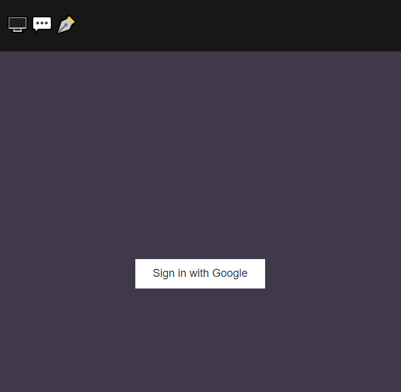

# Chat App

## Description
A chat app created with react and Firebase as an API and backend.

The platform allows for user signup using their google account and communicated with other users of the platform.

## Usage

Link to live demo: https://react-firebase-chat-app-6121e.web.app/


### to run on your own computer

After cloning the repo, 

open the terminal and run
```bash
yarn install
```

after that, opening the code in your browser of choice will result in this image:



from this point you can login the platform using your google account and start using the chat app.


## License
[MIT](https://choosealicense.com/licenses/mit/)

